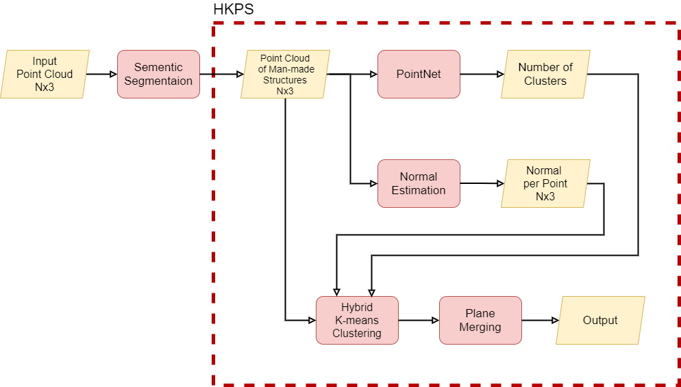
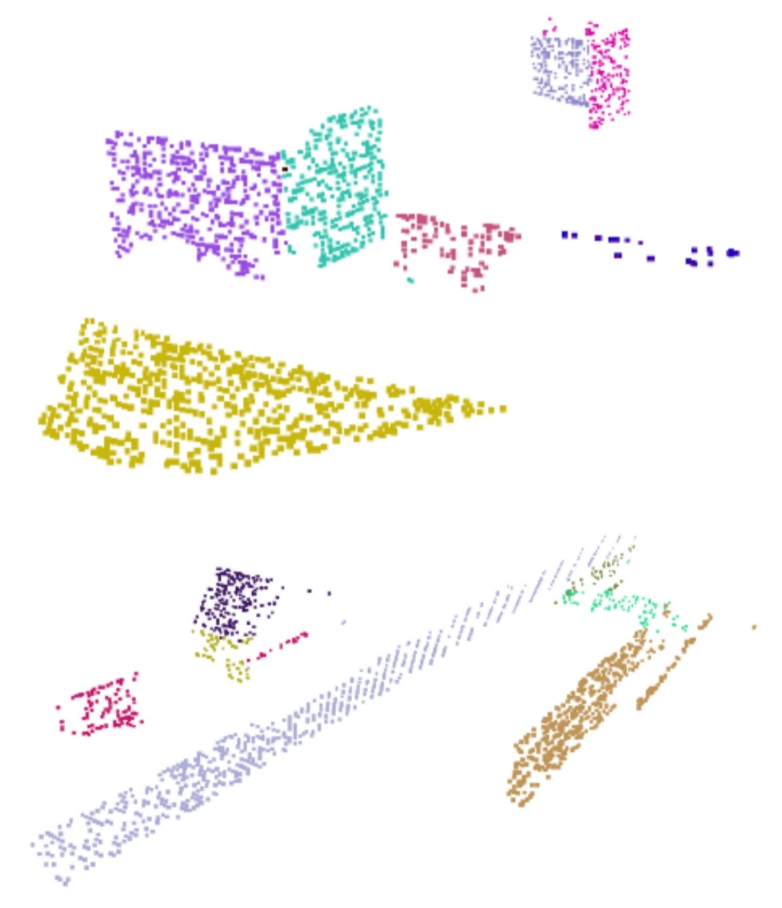

# Clustering Based Plane Segmentation Network for Urban Scene Modeling

The PointNet code is from "https://github.com/charlesq34/pointnet" and "https://github.com/nikitakaraevv/pointnet"

## Network Architecture


## Results


## Requirements
* Python 3.8
* Pytorch 1.7.1
* scikit-learn 0.24.2
* Open3d 0.13.0

## Dataset

We used Virtual KITTI Dataset from <a href="https://github.com/VisualComputingInstitute/vkitti3D-dataset" target="_blank">here</a>. 

We used voxel downsampling to filter the dataset and extract man-made structures such as roads and buildings.

## Installation
```
git clone https://github.com/jimmy9704/plane-segmentation-network.git
cd plane-segmentation-network/
```

## Usage
you can use the notebook HKPS.ipynb to train and valid HKPS(Hybrid K-means Plane Segmentation Network)
 
## Training
```
train(pointnet, dataset,train_loss, epochs=100,make_label=False, save=True)
make_labels(dataset,max_k=15,iteration=10)
```
You can create a label for training PointNet by setting the 'make_label' option to 'True'.

You can change 'max_k' and 'iteration'.

'max_k' is the maximum number that PointNet will estimate

'iteration' is the number of Hybrid-Kmeans iterations

'iteration' can be reduced to reduce time consumption but it might cause unstable results.

## Validation
```
valid(pointnet, dataset, save_num=99,iteration=5)
```
'save_num' is the check point to load for PointNet.


Pre-trained checkpoints can be loaded by setting 'save_num' to 99.

Results are saved as ```.txt``` files. Each file contains a ```N x 6``` matrix, where N is the number of points in a scene and 6 is the number of features per point. The features are XYZRGB. Each column is separated by ```;```.
